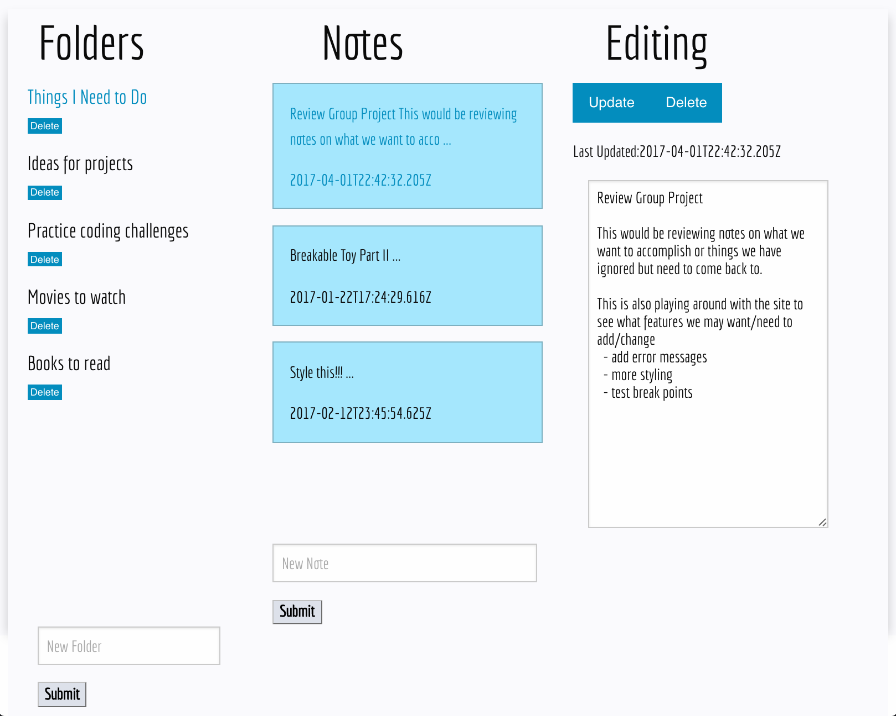

# Notes-App

## Description

Notes-App is an application where users can create folders and notes to keep track of things. This is a single page application that utilizes React.js and lives within a Rails framework. Content is saved in a PostgreSQL database.



## Local Setup

```
git clone https://github.com/eewilcox/Notes-App.git
cd notes-app
bundle install
npm install
rake db:create && rake db:migrate
```

## Contributing

Bug reports and pull requests are welcome on GitHub at https://github.com/eewilcox/Notes-App. Use the [fork-and-branch](http://blog.scottlowe.org/2015/01/27/using-fork-branch-git-workflow/) workflow to contribute.

This project is intended to be a safe, welcoming space for collaboration, and contributors are expected to adhere to the [Contributor Covenant](http://contributor-covenant.org) code of conduct.
